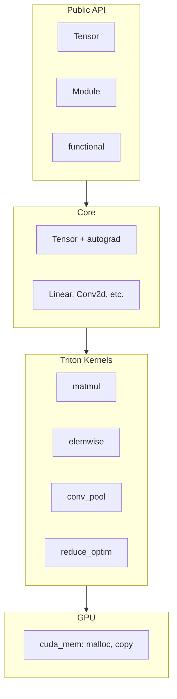
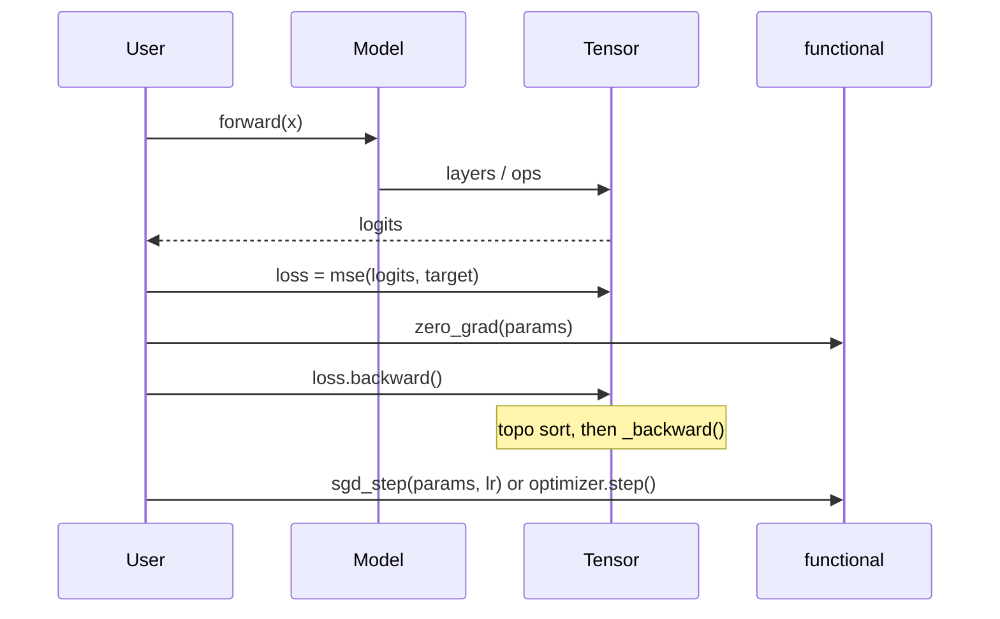
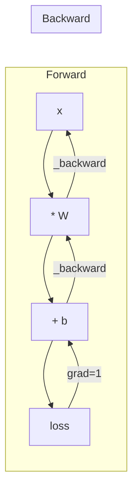

# Gradtuity

**Gradtuity** is a from-scratch tensor autograd engine with Triton GPU kernels. It provides a minimal PyTorch-like API for building and training on GPU. Its written with the intent of being a no dependency library but `torch` and `numpy` is required for calling `triton` kernels.

## Features

- **GPU tensors** via raw CUDA (ctypes + `libcudart.so`), no PyTorch/NumPy for storage.
- **Autograd:** computation graph, `backward()`, topo sort, gradient propagation.
- **Triton kernels:** matmul, elementwise (add, mul, ReLU), conv2d, maxpool2d, reductions, SGD step.
- **NN building blocks:** `Module`, `Linear`, `Conv2d`, `MaxPool2d`, `Flatten`, `Dropout`, `Embedding`, `PositionalEmbedding`, `LayerNorm`, `CausalSelfAttention`, `TiedLMHead`, `MLP`, `CNN` (see [API overview](#api-overview)).
- **Training helpers:** `zero_grad`, `sgd_step` (in [gradtuity/functional.py](gradtuity/functional.py)); optimizers `SGD`, `AdamW`; `clip_grad_norm_` for gradient clipping.
- **Distributed training:** single-node data parallel via NCCL; `gradtuity.dist` (`init`, `sync_grads`, `init_sync`, sampler helpers); launcher `python -m gradtuity.launch --nproc N train_script.py`.
- **Transformer building blocks:** `Embedding`, `PositionalEmbedding`, `CausalSelfAttention`, `LayerNorm`, `TiedLMHead`, `Dropout`.
- **Tokenizer:** BPE `Tokenizer` in `gradtuity.tokenizer` (encode/decode), used by demos/tests.
- **Checkpointing / I/O:** `save_safetensors`, `load_safetensors` ([tensor_io.py](gradtuity/tensor_io.py)); dropout RNG state for reproducibility ([random.py](gradtuity/random.py)).

## Install / Quick start

Requirements: Python 3.12+, CUDA, `numpy`, `torch`, `triton`. See [pyproject.toml](pyproject.toml) for pinned versions.

Install [uv](https://docs.astral.sh/uv/) (Python package manager):

```bash
curl -LsSf https://astral.sh/uv/install.sh | sh
```

Then install dependencies from the repo root:

```bash
uv sync
```

Run the MNIST demo:

```bash
uv run python demos/demo_mnist_mlp.py
```

Training Step Example:

```python
from gradtuity import MLP, Tensor, zero_grad, sgd_step

model = MLP(784, [128, 64, 10])
x = Tensor(...)       # batch of shape (batch_size, 784)
target = Tensor(...)  # one-hot targets (batch_size, 10)

logits = model(x)
loss = logits.mse_loss(target)
model.zero_grad()
loss.backward()
sgd_step(model.parameters(), lr=0.01)
```

Custom Module example:

```python
from gradtuity import Module, Linear, Tensor

class Example(Module):
    def __init__(self, in_features: int, out_features: int):
        self.fc1 = Linear(in_features, 64)
        self.fc2 = Linear(64, out_features)

    def __call__(self, x: Tensor) -> Tensor:
        x = self.fc1(x).relu()
        return self.fc2(x)
```

## Architecture

High-level stack: Python API (Tensor, Module, functional) → core (tensor + nn) → Triton kernels → CUDA memory ([cuda_mem.py](gradtuity/cuda_mem.py), [kernels/](gradtuity/kernels/)).



## Adding a kernel

Kernels live in [gradtuity/kernels/](gradtuity/kernels/) and are written in Triton. To add one:

1. **Define the kernel** in the appropriate file (e.g. [elemwise_kernels.py](gradtuity/kernels/elemwise_kernels.py), [optim_kernels.py](gradtuity/kernels/optim_kernels.py)). Use `@triton.jit`, `tl.pointer_type(tl.float32)` for GPU buffers, and a `BLOCK: tl.constexpr` for the block size. For 1D elementwise ops, use `tl.program_id(0)`, `offsets`, and `mask = offsets < numel`; then `tl.load` / compute / `tl.store`.

2. **Export it** from [gradtuity/kernels/__init__.py](gradtuity/kernels/__init__.py) (import and add to `__all__`).

3. **Call it from Python** in [tensor.py](gradtuity/tensor.py) or [functional.py](gradtuity/functional.py): allocate output if needed (e.g. `empty_tensor(shape)` or `empty_tensor(shape, zero=True)`), then launch with a grid (e.g. `grid1d(numel)`) and pass raw pointers (`tensor.ptr`):

   ```python
   out = empty_tensor(shape)
   my_kernel[grid1d(numel)](out.ptr, x.ptr, numel, BLOCK=BLOCK)
   ```

4. **If the op is differentiable**, call `out._set_graph(parents=(self, ...), backward_fn=_backward)` so `backward()` can propagate gradients. See e.g. `relu` or `add` in [tensor.py](gradtuity/tensor.py) for the pattern.

For a minimal example, see [fill_kernel](gradtuity/kernels/optim_kernels.py) (no autograd) or [add_kernel](gradtuity/kernels/elemwise_kernels.py) (with backward).

## Training loop

Typical training step: forward → scalar loss → `zero_grad` → `backward()` → optimizer step (e.g. `sgd_step` or `AdamW`); optionally `clip_grad_norm_` before the step. Demos: [demos/demo_mnist_mlp.py](demos/demo_mnist_mlp.py), [demos/demo_mnist_cnn.py](demos/demo_mnist_cnn.py).

For **multi-GPU training**, call `gradtuity.dist.init()` at startup, then after `loss.backward()` call `sync_grads(model.parameters())` to all-reduce gradients; spawn workers with `python -m gradtuity.launch --nproc N script.py`. See [demos/demo_mnist_dist.py](demos/demo_mnist_dist.py).



## Autograd

Backward seeds the loss with grad 1.0, then walks the graph in reverse topological order and calls each op's `_backward` to propagate gradients to parameters ([tensor.py](gradtuity/tensor.py) `backward()` and op `_parents`/`_backward`).



## API overview

- **Tensors:** `Tensor(data, shape?, requires_grad?)`, `.backward()`, `.grad`; factories: `zeros`, `ones`, `randn`, etc. in `functional`.
- **Training:** `zero_grad(params)`, `sgd_step(params, lr)`; optimizers `SGD`, `AdamW`; `clip_grad_norm_` for gradient clipping.
- **NN:** `Module`, `Linear`, `Conv2d`, `MaxPool2d`, `Flatten`, `Dropout`, `Embedding`, `PositionalEmbedding`, `LayerNorm`, `CausalSelfAttention`, `TiedLMHead`, `MLP`, `CNN` from [gradtuity.nn](gradtuity/nn.py).
- **Distributed:** `gradtuity.dist`: `init`, `sync_grads`, `init_sync`, `get_rank`, `get_world_size`, `distributed_indices`, `shard_size`; launcher: `python -m gradtuity.launch`.
- **I/O and tokenizer:** `save_safetensors`, `load_safetensors`; `Tokenizer`; optional: DropoutRNG / state dict for checkpointing.

See docstrings and [gradtuity/tests/](gradtuity/tests/) for details.

## Demos and tests

- **Demos:** Run with `uv run python demos/<script>.py` from repo root:
  - `demo_mnist_mlp.py`, `demo_mnist_cnn.py` — MNIST MLP/CNN
  - `demo_mnist_dist.py` — distributed MNIST (multi-GPU)
  - `demo_train.py` — minimal MLP training
  - `demo_checkpoint.py` — SafeTensors save/load and resume
  - `demo_moons.py` — Moons dataset
  - `demo_tokenizer.py` — BPE tokenizer
- **Tests:** `pytest gradtuity/tests` (from repo root). Markers: `requires_cuda`, `requires_triton`, `requires_nccl`, `requires_multigpu` (see [pyproject.toml](pyproject.toml)).

## License

MIT License. See [LICENSE](LICENSE).
